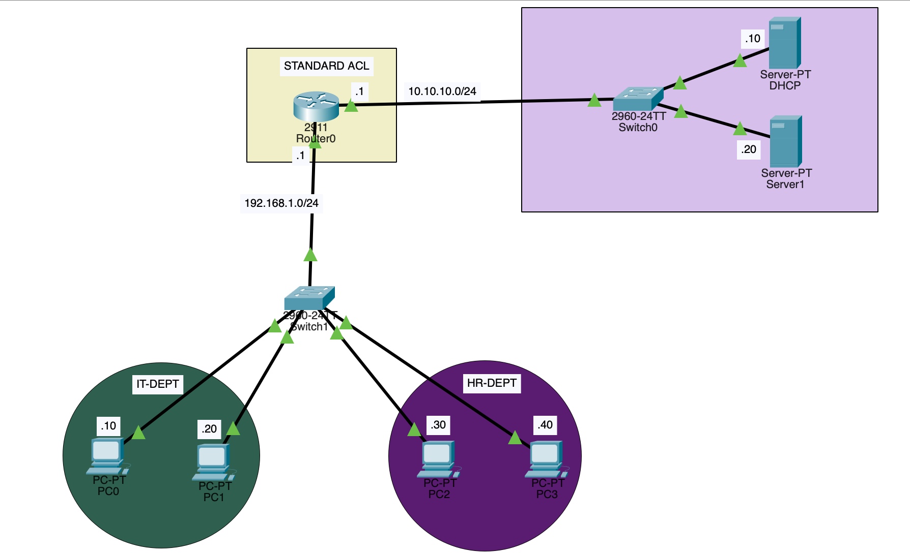

# Standard Access Control List (ACL) – Cisco Lab

## Project Overview
This project demonstrates how to configure and apply a **Standard Access Control List (ACL)** on a Cisco router to control traffic based on the **source IP address**.

In this lab:
- Only two specific hosts are permitted
- All other sources are denied
- ACL is applied inbound on the router interface connected to the LAN

---
## Topology
The lab includes:
- **LAN (Users):** `192.168.1.0/24` (IT + HR PCs)
- **Server Network:** `10.10.10.0/24` (DHCP + Server)
- **Router:** connects LAN and Server network
- **Switches:** provide L2 connectivity


 

---

## What is a Standard ACL?
A **Standard ACL** filters packets using **only the source IPv4 address**.

**Key points**
- Standard ACL number range: **1–99** (and 1300–1999)
- Cannot match destination IP, protocol, or ports
- Best practice: place Standard ACLs **close to the destination** (because they are broad)

---

## ACL Objective
Allow only:
- `192.168.1.10`
- `192.168.1.20`

Deny all other sources.

---

## Configuration (Router)
```bash
enable
configure terminal

access-list 10 permit host 192.168.1.10
access-list 10 permit host 192.168.1.20
access-list 10 deny any

interface gig0/0
ip access-group 10 in
exit

write memory
```

---

## Verification
```bash
show access-lists
show ip interface gig0/0
```

---

## Remove / Rollback
Remove ACL lines:
```bash
no access-list 10
```

If you also want to remove it from the interface:
```bash
interface gig0/0
no ip access-group 10 in
```

---

## Repository Structure
```
standard-acl-lab/
├── README.md
├── docs/
│   └── topology.png
├── configs/
│   └── router/
│       └── R1-standard-acl.txt
└── packet-tracer/
    └── Standard-ACL-Lab.pkt
```

---

## Key Learning Outcomes
- Standard ACL behavior (source-based filtering)
- Applying ACLs to interfaces using `ip access-group`
- Verification using `show access-lists`
- Safe rollback/removal

